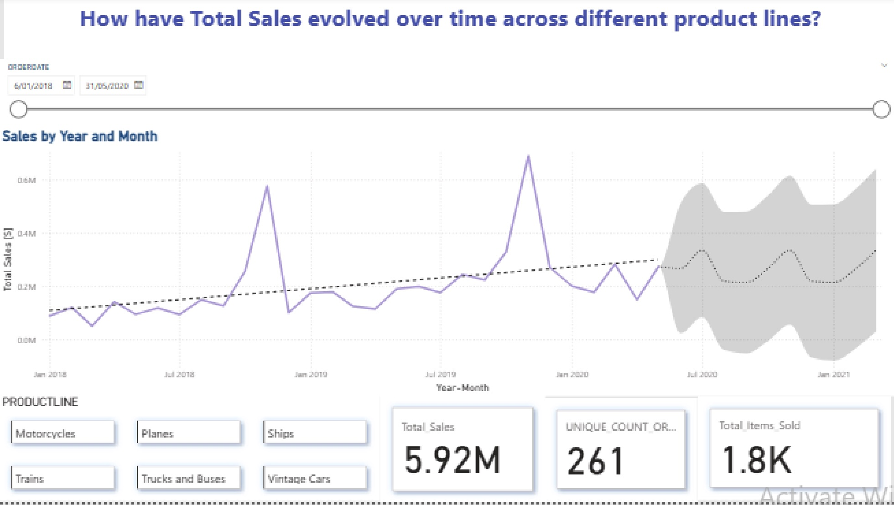
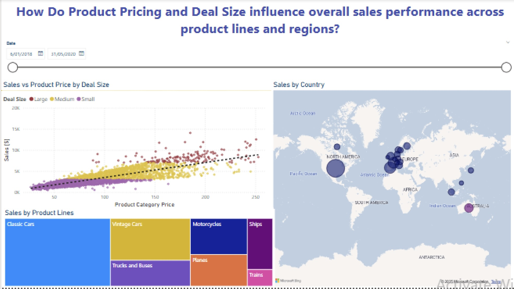
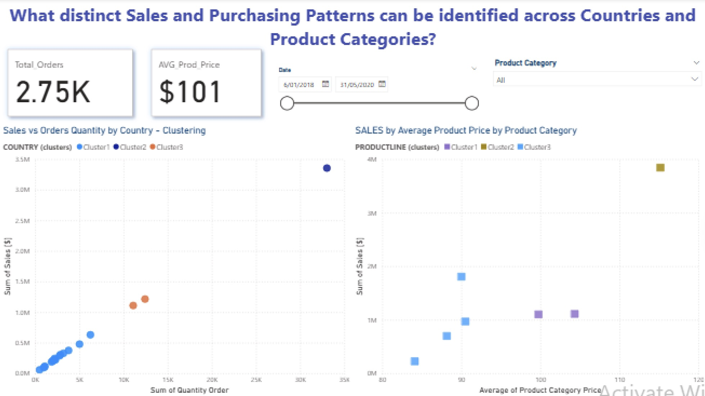
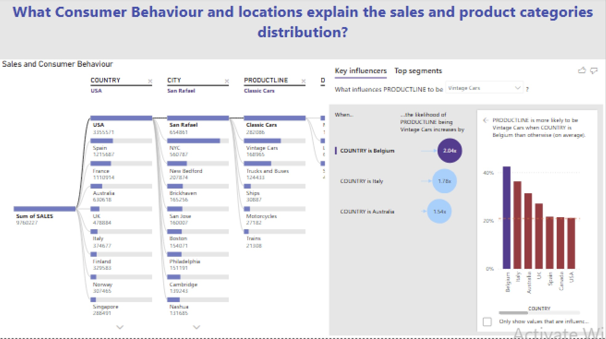
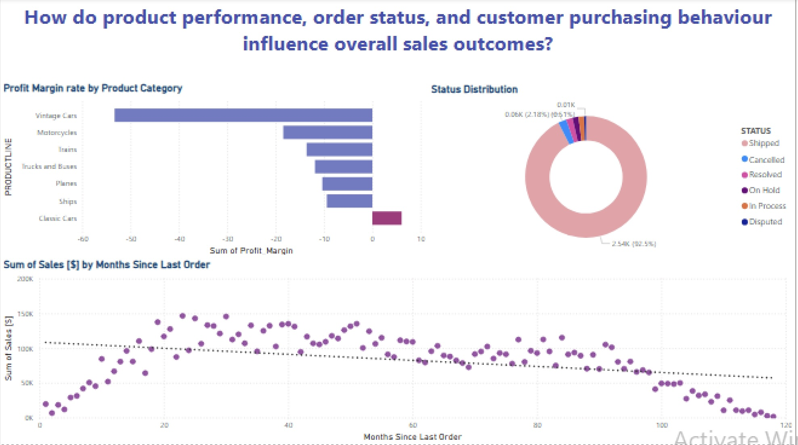

# Automobile-Sales-Dataset-Analysis
Analysed a global automobile sales dataset (2,748 records) from Kaggle platform using Python to identify sales trends, customer purchasing behaviour, pricing strategies, regional performance, and key factors influencing vehicle sales through data analysis and visualisation.

# Dataset

| Feature | Description | 
|---|---|
| OrderDate | Date when the vehicle order was placed |
| ProductLine | Vehicle category or product range |
| QuantityOrdered | Number of vehicles ordered | 
| PriceEach | Price per vehicle unit | 
| Sales | Total sales value calculated as QuantityOrdered × PriceEach |
| CustomerID | Unique identifier for each customer |
| Country | Customer or market location | 
| Territory/Region | Geographic sales region |
| OrderStatus | Current status of the order | 
| DealSize | Transaction size classification (Small, Medium, Large) | 

# Key Findings - Automobile Sales Performance Dashboard

* Overall Sales Performance

Generated $9.8M in total sales from 2.7K vehicles sold across 298 unique orders.
Sales showed a steady growth trend between 2018–2020, with projected monthly sales between $460K–$580K for the following period.
Large deal sizes contributed the highest sales volume, highlighting the importance of high-value customers.

* Product & Market Analysis

Classic Cars were the strongest-performing product line, generating the highest demand and the only positive profit margin (+6%).
Vintage Cars showed the largest margin loss (-53.3%), suggesting pricing challenges or excessive discounting.
Sales activity was strongest across North America, Europe, and Australia.
High-value demand was concentrated in:
Classic Cars
Vintage Cars
Trucks & Buses

* Customer & Sales Segmentation

Country clusters revealed key markets:
🇺🇸 USA: Over $3M in sales (highest-performing market).
🇪🇸 Spain & 🇫🇷 France: Around $1M in sales.
Other countries: Below $1M collectively.
Product clusters showed:
Classic Cars as the main revenue driver (>$3M sales).
Motorcycles and Trucks & Buses generating around $1M sales.
Remaining product categories contributing lower sales volumes.

* Order & Customer Behaviour

92.5% of orders were successfully shipped, while only 0.51% were disputed, indicating strong operational performance.
Customers with less than 23 months since their last order showed increasing sales activity.
Higher-value customers were mainly identified between 20 and 92 months of relationship history, representing key opportunities for retention strategies.

# Power BI Dashboard Screenshots

# Dataset Source

https://www.kaggle.com/datasets/ddosad/auto-sales-data/data?utm_source=chatgpt.com
